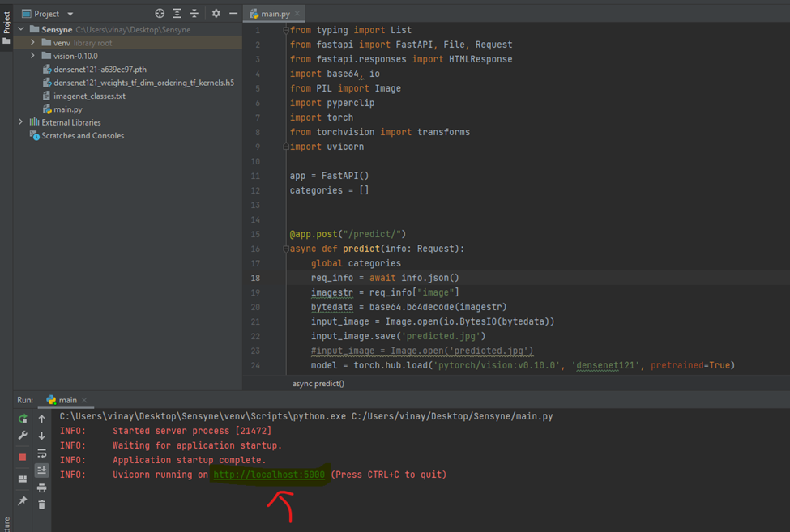
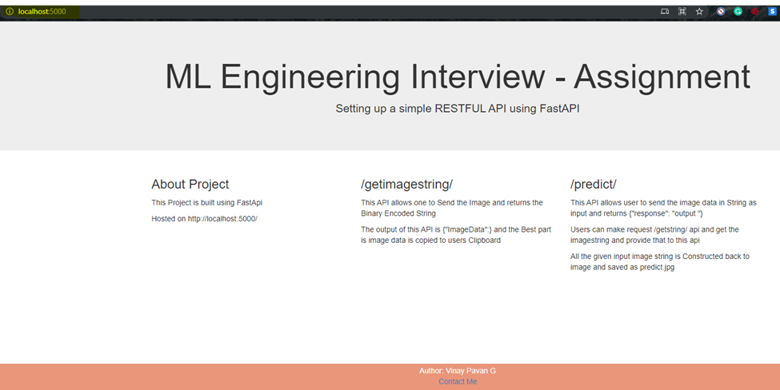
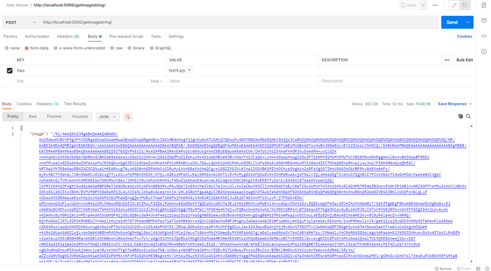
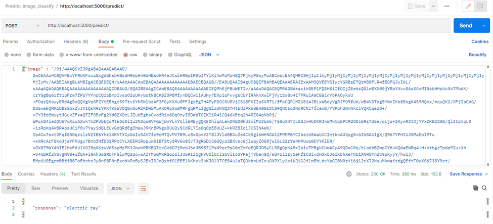

This repo has the following artifacts

 vision-0.10.0 # Torch vision package consists of pre trained model architectures & Common Image Transformations for computer vision.
 ImageClassifier.py         # Source code
 imagenet_classes.txt # consists of image labels
 response.json # Image string data
 ReadME.md # Provides information on reproduce the results
 Predict_Image_classify.postman_collection.json  # PPostman collection to be imported to run the requests from API
Code Testing is done using post man.

**Steps to reproduce the results:**
**Step 1** : Run the ImageClassifier.py file , once the application is started click on the http://localhost:5000
 

**Step 2** : In post man import the collection attached from GitHub into postman
 

**Step 3** : To get the Image data request use the end point / getimagestring 
http://localhost:5000/getimagestring/ from the postman collection by uploading the required image to be tested
 

**Step 4** : Once you get  the image data from the image, use the end point http://localhost:5000/predict/
To get the response. Please refer the below screenshot
 

Step 5 : you can upload any image and get the imagedata from the /getimagestring/ end point response from the predict /predict/ endpoint. 
I have done the testing using postman alternatively you can use curl command aswell.

**Using CURL**
Once you have the image data save the string in Json format and use the below command to get the response from the /predict endpoint
curl -XPOST -d @request.json http://localhost:5000/predict/
Here the request.json contains the image data

